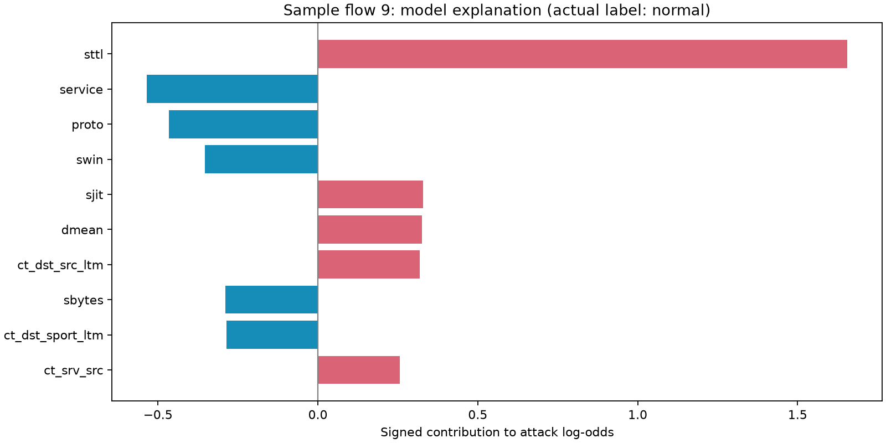
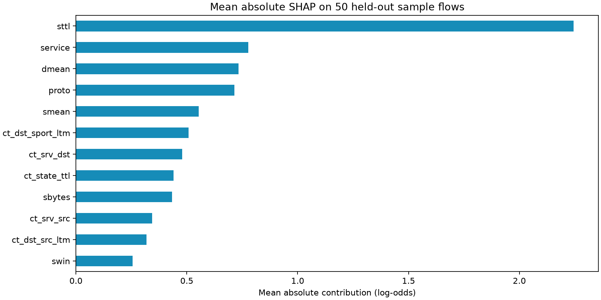

# Understanding a traffic flag

The **Explain** button answers why the binary model assigned a particular attack score. It computes native CatBoost TreeSHAP contributions using the loaded prediction model and that flow's validated features.

## Read the explanation

- A positive contribution raises the model's attack log-odds.
- A negative contribution lowers them, toward normal.
- The feature value is shown beside its contribution.
- The score is compared with the frozen validation-selected threshold.
- If a supplied label says Normal for a flagged flow, the dashboard explicitly identifies a false positive. An explanation does not make an incorrect prediction correct.

Contributions are additive **in raw log-odds**, not probability:

```text
raw_score = base_value + sum(all 42 feature contributions)
attack_score = sigmoid(raw_score) = 1 / (1 + exp(-raw_score))
flagged = attack_score >= saved_threshold
```

The dashboard shows ten strongest contributions by absolute magnitude and the sum of the remaining terms. Together they reconstruct the full model score. Tests verify additivity and agreement with normal prediction. The base is a model reference value in raw-score space, not a universal normal score or the real network's attack prevalence.

[CatBoost's SHAP documentation](https://catboost.ai/docs/en/concepts/shap-values) describes the native implementation. No additional SHAP package is required.

## Local and sample-level explanations

This example is intentionally a false positive from the held-out replay sample. It illustrates how model reasoning can be inspected without treating it as evidence of a confirmed attack.



The following chart averages absolute contributions over **50 held-out sample flows**, using all 42 features. It is a bounded sample diagnostic; it is not population-wide importance or a causal ranking.



Reproduce these artifacts:

```bash
python -m scripts.explain_sample
```

## API and persistence

- `POST /api/explain`: JSON `{"flows": [...]}`, up to 100 records.
- `GET /api/batches/{batch_id}/flows/{row_number}/explain`: explain one stored flow, using its 1-based row number.

New review batches retain validated feature vectors for explanations, in addition to prediction records. The original uploaded CSV file is not retained. Earlier databases are migrated; batches without saved features return 409 and need replay or upload again. Batches from a different model version also return 409, preventing explanations from a model that did not produce the stored prediction.

## What explanations cannot establish

Contributions describe this fitted model's use of the input representation. Correlated features, training distribution, and the chosen reference affect attribution. The results are not causal findings, calibrated confidence, proof of malicious intent, or evidence that a decision will transfer to a different network. These explanations concern the binary detector; experimental attack-category suggestions come from a separate classifier.
