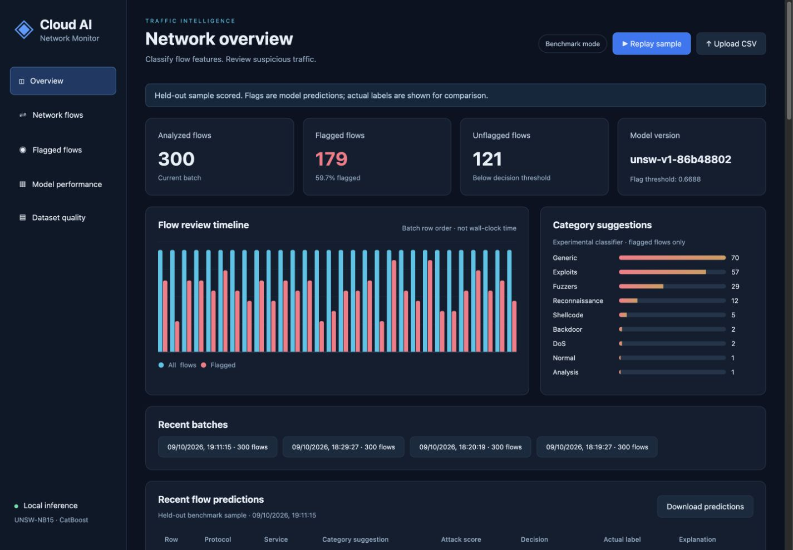
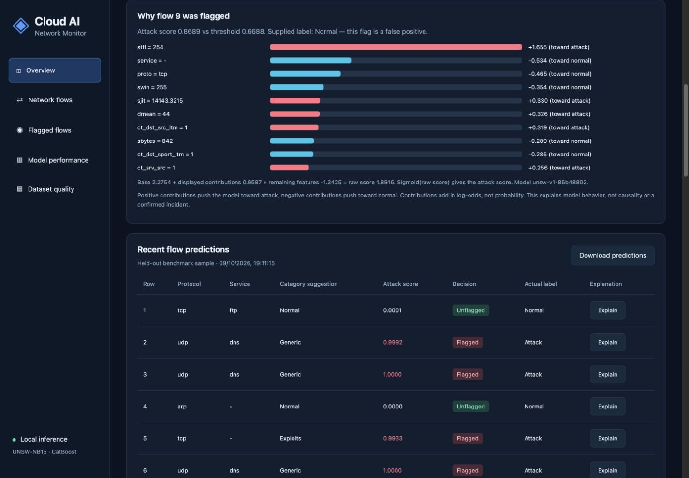
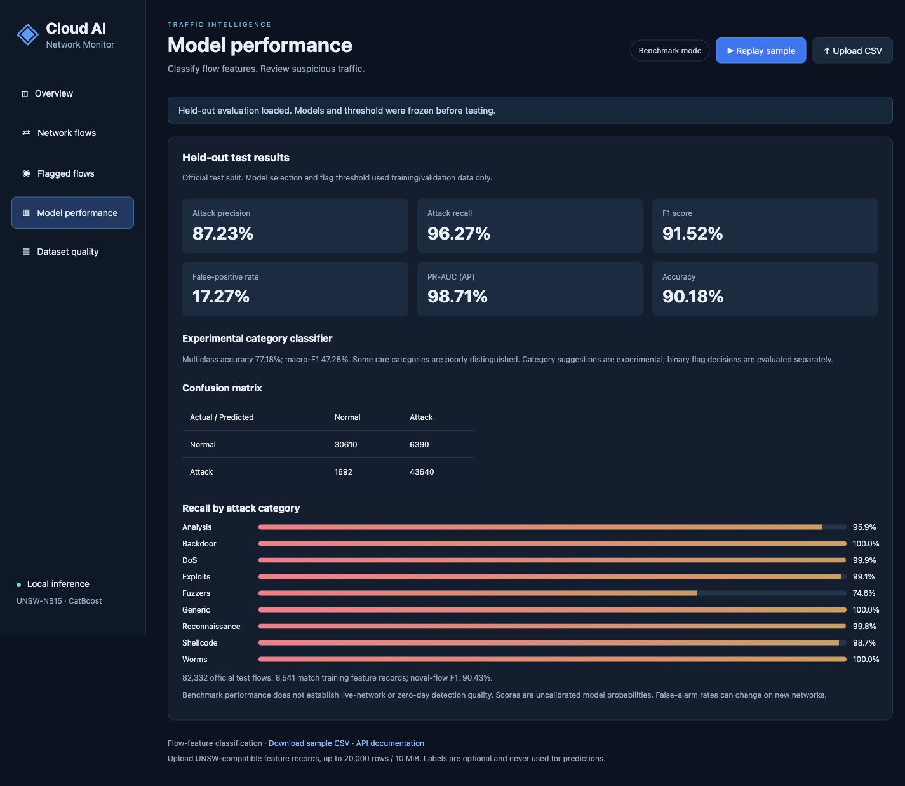
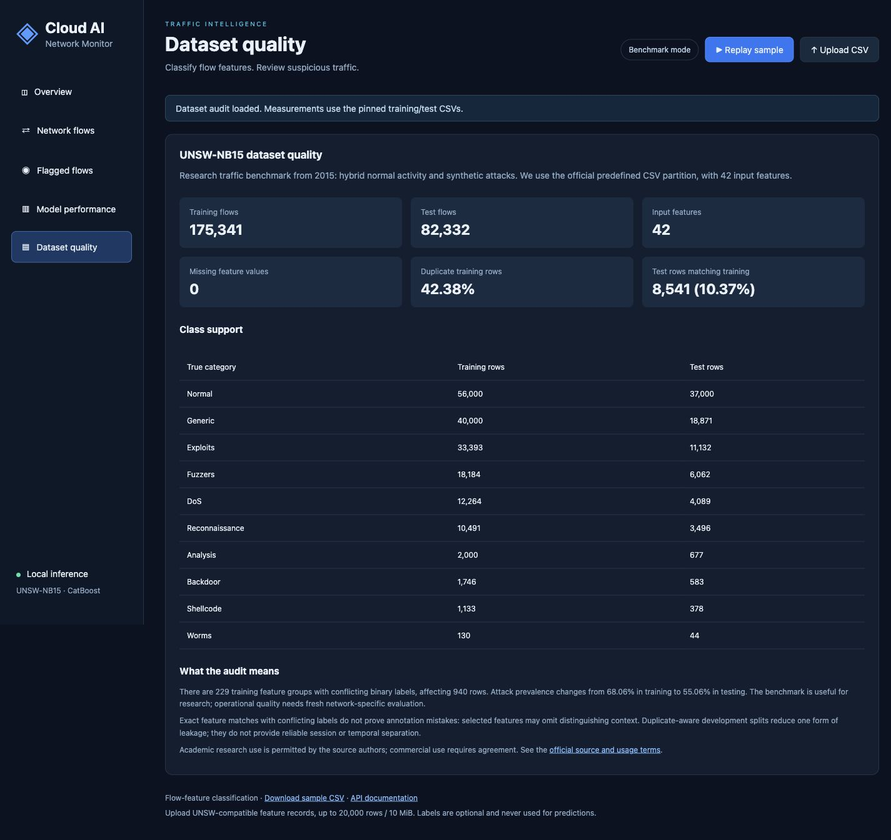
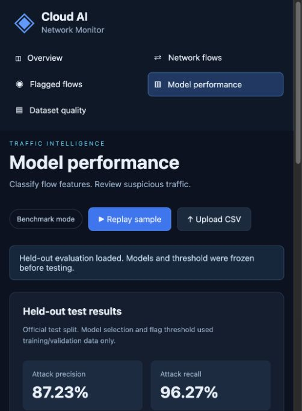

# Dashboard walkthrough

These are screenshots of the running local application, using actual held-out sample predictions and the measured dataset audit. They are not generated mockups. Desktop readability was checked at 1440 × 1000; the narrow browser panel was also checked for horizontal overflow, then the viewport override was reset.

## 1. Score and review traffic

Replay 300 held-out sample flows or upload a compatible feature CSV. The original sample produces 179 flags. Traffic charts use batch row order rather than claiming wall-clock live monitoring.

## 2. Explain an individual flag

Select **Explain** next to a flow. Positive/red terms raise attack log-odds; negative/cyan terms lower them. The base and all contributions reconstruct the raw score, whose sigmoid produces the attack score. This example is explicitly a false positive according to its supplied label; SHAP is not evidence that the flow is malicious.

## 3. Inspect held-out evaluation

Precision, recall, F1, false-positive rate, confusion matrix, and category support remain visible. The separate category model is experimental, with weak rare-category performance.

## 4. Assess the dataset

The data page separates structural cleanliness from duplicates, overlap, ambiguous selected-feature groups, class imbalance, and deployment limitations. See [DATASET.md](DATASET.md) for the full provenance and source terms.

## 5. Narrow layout

The same data page remains readable in the app's narrow browser panel.

